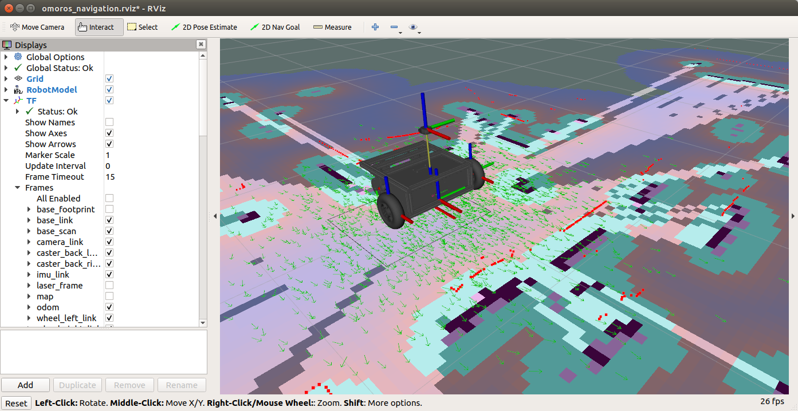
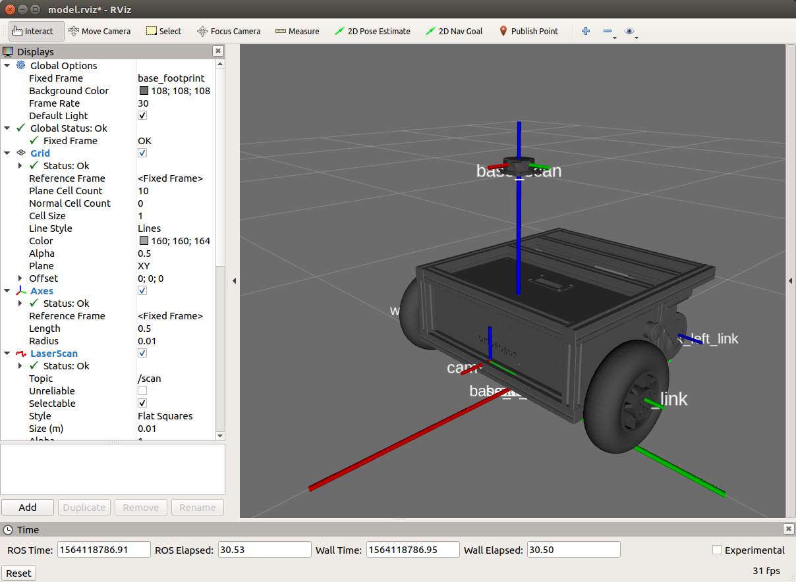
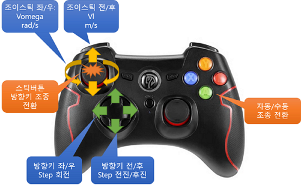
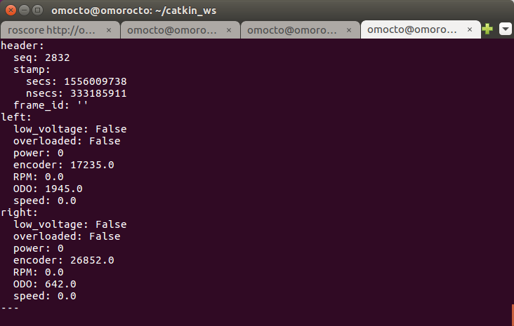
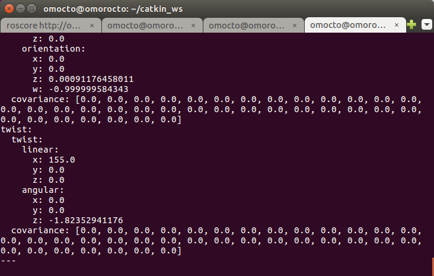

# OMOROS

This project contains ROS support driver and navigation packages for OMOROBOT's research platform R-1 and R-1 mini.
This packages allows users not only run the robot but also start mapping and autonomous navigation when equipped with 2-D lidar such as ydlidar sensor.
(Latest version tested with ROS-melodic installation)

**한국어**[문서](README_KR.md)

<div align="center">
  
</div>

Currently supporting models: 

- [OMO-R1](https://www.omorobot.com/omo-r1)
- [OMO-R1-mini](https://www.omorobot.com/omo-r1-mini)

# Index
- [1. Installations](#1-installations)
- [2. How to use](#2-how-to-use)
- [3. Trouble shooting](#3-trouble-shooting)
- [4. SLAM Mapping & Navigation](#4-slam-mapping--navigation)

## 1. Installations

### 1.1 ROS on Ubuntu Linux

git clone this package into the source folder of your ROS catkin workspace i.e, under ros_catkin_ws/src.
(This package is also tested under ROS-Kinetic or ROS-Melodic)

```
$ cd to catkin_ws/src
$ git clone https://github.com/omorobot/omoros.git
$ cd to catkin_ws
$ catkin_make
```

### 1.2 ROS-Kinetic on Raspbian 

If you are using Raspberry pie (pie), follow instructions below.
In order to use libraries such as tf2, it is recommended to install with Desktop version of ROS.

[Installing ROS Kinetic on the Raspberry Pie](http://wiki.ros.org/ROSberryPi/Installing%20ROS%20Kinetic%20on%20the%20Raspberry%20Pi)

** Install from the image already installed the entire packages **

If you are un familiar with installing in pie machine and avoid hassles installing all the packages, you can also download the entire image of the system from below link.

[Raspian stretch image with ROS-kinetic installed](https://drive.google.com/open?id=1jAGlkIUAB_SLq0WCe1G4SktzwUm7abHW)

When first boot from burned image file, use raspi-config and expand file system to the size of the SD memory card.

<div align="center">

</div>

### 1.3 Dependency

Following packages may require to run the driver.
Refer to below links for specific intallations.

* run below script to install joy node.

```
$ sudo apt install libusb-dev libbluetooth-dev libcwiid-dev libspnav-dev
```

Joy: [ROS JOY](http://wiki.ros.org/joy)

tf: [ROS TF](http://wiki.ros.org/tf)

### 1.4 Serial Port Configuations

Attach the USB to Serial port into the PC and check the path of the port. 
Normally these paths are set as /dev/ttyUSB# however, the numbers are regularly changed by order of connections and not fixed.

You will need to modify contents of /etc/udev/rules.d to fix the path of the port.

Use lsusb command to identify idVendor and idProduct your USB-Serial port.
```
$ lsusb
Bus 001 Device 029: ID 0403:6001 Future Technology Devices International, Ltd FT232 USB-Serial (UART) IC
```
Check numbers followed by ID and the former one ("0403" part) is idVendor while the latter"6001" represents idProduct.
Go to bringup folder and open "99-omoros.rules" with your favorite text editor and modify numbers accordingly.
```
SUBSYSTEM=="tty", ATTRS{idVendor}=="0403", ATTRS{idProduct}=="6001", MODE:="0666", GROUP:="dialout", SYMLINK+="ttyMotor"
```
Now run the script file "create_udev_rules" to generate rules under /etc/udev/rules.d and your usb-to-serial port will always have /dev/ttyMotor as its path.
```
$ ./create_udev_rules
This script copies a udev rule to /etc/udev/rules.d/ to fix serial port path 
to /dev/ttyMotor for omoros driver.


Reload rules
```

## 2. How to use

### 2.1 Launching omoros_core

In the launch folder, there are some files to run omoros driver or navigation packages.

To test drive the robot with Joystick, simply run omoros_core.launch in the terminal as below.

```
$ roslaunch omoroslaunch omoros omoros_core.launch <param>
```

You can input different parameters in <param> as below
 
- set_model:= Model name (default is "r1". To change model to R1-mini change set_model:=mini)
- set_port:= Path to the serial port (default is "/dev/ttyMotor")
 
If you want to change values in the code, open omoros_core.launch file under /launch folder and find <node pkg="omoros"

**Notice** Make sure your serial to USB device is working corrently.

If you find any issues relate to serial ports, refer to [Serial](#serial)

Now open the terminal and enter below command to run omoros_core.launch.
```
$ roslaunch omoros omoros_core.launch
```

After you hear beeping sound from the robot, you can see robot is moving in the simulated evironment such as rviz.
Run rosrun rviz rviz to see if the robot moves according to your command.

<div align="center">
  
</div>


### 2.2 Controlling the robot

Below image describes how you can operate the robot using joystick command.

<div align="center">
  
</div>

 - Move stick FWD/REV and Left/Right for manual control.
 - If you press arrow buttons, the robot will move certain distance or angle.
 - To switch from manual control mode to auto, press 'A' or '1' button and the robot will move per cmd_vel message from otehr nodes.
 
If there is error controlling with joystick, please see [next](#joystick).

### 2.3 Messages

This driver will publish or subscribe below messages.

```
$ rostopic list

/cmd_vel
/diagnostics
/joy
/joy/set_feedback
/motor/encoder/left
/motor/encoder/right
/motor/status
/odom
```

**Subscribed message**

* joy 
  - Axis: Stick input of the Joystick's FWD/REV and Left/Right will be converted to each motor's wheel speed.
  - BUttons: Switch control mode between Manual and Auto mode by pressing button "1" or "A".


* cmd_vel
  - http://wiki.ros.org/Robots/TIAGo/Tutorials/motions/cmd_vel
  - cmd.linear.x : Robot's translational speed in m/s
  - cmd.angular.z : Robot's rotational speed in rad/s

**Publish message**

* motor/encoder/left or right: Output accumulated encoder counts of each motor.

* motor/status 
   - Output Encoder counts, RPM, ODO, speed(mm/s).
<div align="center">
  
</div>

* odom: Translational speed and rotational speed of the robot for Navigation.
 - Sub-link of "odom" is "base_link".
<div align="center">
  
</div>

## 3. Trouble shooting

### 3.1 <a name="serial"> Serial Port Error </a>
* Permission error: Add user dialout

If you see messages like below and cannot open the port.

[Errno 13] Permission denied: '/dev/ttyUSB0'

Add user group to dialout using below command.

'''
$ sudo gpasswd -a UserName dialout
'''

Log out and re log-in then it should run correctly.

* If the serial port cannot be opened.

Check path of the serial port.

Open launch/omoros_core.launch and modify below line.

```
      <param name="port" value="/dev/ttyMotor"/>
```

In order to use Raspberry Pie's insternal serial port, change the port name as below.

'/dev/ttyS0'

### 3.2 <a name="joystick"> Joystick index Error </a>

Depending on the type of joysticks, it may cause some errors and is due from different index numbers assigned to each buttons or axis.

Use "rostopic echo joy" command to check index numbers of each axes and buttons assigned to pyisical joystick.
If the numbers are different from what you see in the topic, change the numbers in self.joyAxes[#] or self.joyButtons[#] accordingly.
```
---
header: 
  seq: 14
  stamp: 
    secs: 1559113339
    nsecs: 939150960
  frame_id: ''
axes: [0.0, 0.0, 0.0, 0.0, 0.0, 0.0]
buttons: [0, 1, 0, 0, 0, 0, 0, 0, 0, 0, 0, 0, 0]
---
```

## 4 SLAM Mapping & Navigation

With the help of 2D lidar sensor such as YDLidar, the Robot can generate maps and start navigate autonomously by applying SLAM technologies already implemented in ROS.
You can test run SLAM and navigation by running omoros_navigation.launch file as below.

### 4.1 Requirements

 - YDLidar can be purchased from https://www.amazon.com/SmartFly-info-LIDAR-053-YDLIDAR-Frequency/dp/B07DBYHJVQ/ref=sr_1_1?keywords=ydlidar&qid=1568906093&sr=8-1 or https://smartstore.naver.com/omorobot/products/4445001397
 - ROS must be installed with Desktop-Full 
 - Below packages maybe required to run omoros_navigation.launch

### Install YDLidar

Go to src folder uner catkin_ws and download packages as below.
```
$ git clone https://github.com/EAIBOT/ydlidar.git
```
catkin_make to install package.
```
$ catkin_make --pkg ydlidar
```
Go to startup in the package and run initenv.sh to assign port name of the usb-to-serial port.

For detailed installation, please refer to https://github.com/EAIBOT/ydlidar

### Install ROS packages for SLAM and navigation

use apt command to install necessary packages. (Per ROS-Melodic)
```
$ sudo apt install ros-melodic-amcl ros-melodic-gmapping ros-melodic-navigation

```

### 4.2 Launch omoros navigation

Once installation is completed, use roslaunch to run omoros navigation launch file.
```
$ roslaunch omoros omoros_navigation.launch 
```


Copyright (c) 2019, OMOROBOT Inc.,

